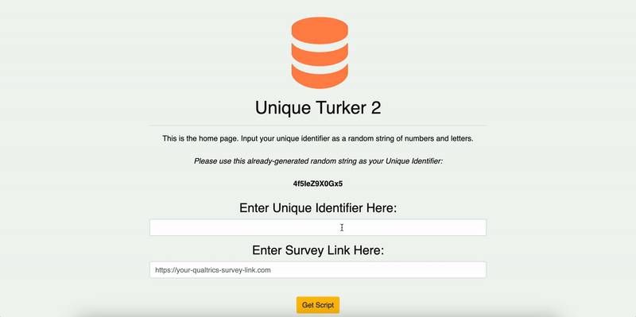

  

# unique-turker-2

Flask app with a built-in database that can be used by Mechanical Turk requesters to prevent duplicate HIT access from Mechanical Turk workers.

## 🔍Purpose

Unique Turker was a service created by Myle Ott that was designed for researchers and developers who use Amazon's Mechanical Turk (MTurk) platform. In short, it allowed requesters to avoid the 40% MTurk fee that comes when recruiting more than 9 workers in a single batch. Although one could deploy a HIT with multiple batches of <9 workers, there was no gaurantee that those same workers could access another batch from that same HIT. To combat this, requesters could go on the Unique Turker site and obtain a snippet code that they could include in their HIT HTML source code. This snippet of code communicated with the Unique Turker database to ensure that each worker could complete a particular HIT only once, thus preventing duplicate submissions. For academic researchers, obtaining unique, non-repeated responses is an especially desirable quality when collect data as multiple data submissions from the same participant is usually of no use. Therefore, Unique Turker was valuable for allowing researchers to save money while also not getting duplicated responses\*. Unfortunately, however, Unique Turker went down in 2022 and seems to no longer be maintained.

`unique-turker-2` is a software that I created which does exactly what Unique Turker did. It allows researchers to set up their own living and breathing server that can interact with their HITs to record worker data and, importantly, prevent multiple workers from accessing the same HIT. It's packaged as a `Flask` web application that users can readily download and host somewhere online (e.g., Heroku, Docker). Once deployed, users can access their web app, enter a unique ID for each new HIT they'd like to deploy and receive the custom HIT HTML code that communicates with their web app. Worker IDs are stored in a SQLite database.

\*Note that there was a way for some workers to bypass Unique Turker in the past and so I'm similarly not expecting for perfect preventing of duplicate workers. Indeed, I've run a few HITs to see how effective `unique-turker-2` is and very, very few workers had repeated responses (e.g., 2 out of 500 workers in my first run).

## ⬆️Deploy Your Own

Steps for setting up and deploying the app:

1. Make sure to change the site in output.HTML to redirect to your site.

## 👨 💻How To Use

Steps on how to use the web app:

## ✨Demo✨

